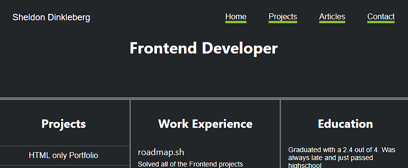

# Personal Portfolio

## HTML and CSS Portfolio Project

## Description

- The motivation behind this project was to practive my HTML and CSS skills
- Built this project to display my skills
- This project will help others get a better understanding of my HTML and CSS skills
- While building this project, i got a better grasp of media queries
- This project stands out because it adapts to any screen size 

## Usage

- Click on the link to open website[https://0mar77.github.io/personal-portfolio-css/]
- Click on the link to open repository[https://github.com/0mar77/personal-portfolio-css]

## Project Page URL

[https://roadmap.sh/projects/portfolio-website]